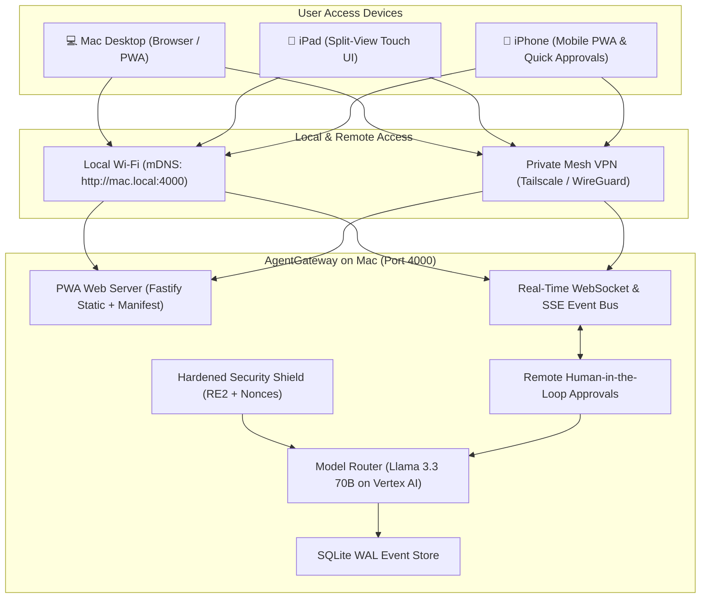

# Implementation Plan: AgentGateway — Multi-Device Control Plane (Mac, iPad, iPhone)

A comprehensive architectural plan for **AgentGateway**, featuring a responsive, multi-device dashboard designed for macOS, iPadOS, and iOS, with enterprise privacy, hardened security, and Google Cloud Vertex AI integration.



---

## 1. Multi-Device Dashboard Design (Mac, iPad, iPhone)

The Web Control Console will be built as a **responsive Progressive Web App (PWA)** that dynamically adapts its layout depending on screen size and device capabilities.

### Device-Specific Layouts

| Device | Interface Form Factor | Key Features |
| :--- | :--- | :--- |
| **💻 Mac Desktop** | **Multi-Column Power Console** (`>= 1024px`) | Persistent left sidebar, real-time WebSocket live table, side-by-side prompt diff inspector, rich charts. |
| **📱 iPad / Tablet** | **Touch Split-View** (`768px – 1023px`) | Collapsible sidebar, touch-friendly metric cards, Apple Pencil / touch support, slide-over approval sheet. |
| **📱 iPhone / Mobile** | **Native-feel Mobile PWA** (`< 768px`) | Fixed bottom navigation tab bar (`Overview`, `Live Stream`, `Approvals`, `Security`), swipe-to-dismiss modals, high-visibility push-card action approvals. |

---

### iPhone / iPad Wireframe (Mobile View)

```
+---------------------------------------+
|  ⚡ AgentGateway            [🟢 Live] |
|  Spend Today: $1.42 / $10   Agents: 3 |
+---------------------------------------+
|  ⚠️ PENDING APPROVAL (1)              |
|  +---------------------------------+  |
|  | Agent: "CoderBot"               |  |
|  | Tool:  run_command              |  |
|  | Cmd:   "git push origin main"   |  |
|  |                                 |  |
|  |  [  ✅ Approve  ]  [  ❌ Deny  ] |  |
|  +---------------------------------+  |
+---------------------------------------+
|  RECENT ACTIVITY                      |
|  • 03:08 PM - Gemini 2.5 Flash        |
|    "Search repo for utils" (240ms)   |
|  • 03:07 PM - Llama 3.3 70B           |
|    "Refactor auth logic" (4.1s)      |
|    🛡 1 Email Tokenized              |
+---------------------------------------+
|  [📊 Home]  [🌊 Live]  [🔔 (1)]  [⚙]  |
+---------------------------------------+
```

---

## 2. iOS / iPadOS Integration & PWA Capabilities

1. **Add to Home Screen (PWA)**:
   - Includes `manifest.json`, `apple-touch-icon.png`, and iOS splash screen meta tags (`apple-mobile-web-app-capable: yes`).
   - When opened in Safari on iPhone or iPad, tapping **Share → Add to Home Screen** installs it as a standalone app with **zero browser URL bar** and smooth native transitions.
2. **Network Connectivity**:
   - **On Home/Office Wi-Fi**: Accessible at `http://<your-mac-name>.local:4000` via Bonjour / mDNS.
   - **On Cellular / Remote (Away from Home)**: Seamlessly accessible via **Tailscale** (e.g. `http://100.x.y.z:4000`) over an end-to-end encrypted private mesh VPN with zero port forwarding required.
3. **Remote Action Approvals**:
   - Approve or deny high-risk agent tool actions from your phone or iPad while away from your desk.

---

## 3. Hardened Security & Model Architecture (Recap)

* **Primary Model Engine**: **Google Cloud Vertex AI (`meta/llama-3.3-70b-instruct`)** with **Gemini 2.5 Flash** fallback.
* **Zero-Trust Key Management**: Google Cloud IAM OAuth2 tokens (no plain-text API keys).
* **Privacy & DLP Engine**:
  * Linear-time non-backtracking scanner (`re2`) immune to ReDoS attacks.
  * Ephemeral cryptographic UUID nonces (`<SECRET_MASK_uuid>`) preventing prompt-injection probing.
  * Structural pre-parsing (unpacks JSON and base64 payloads before scanning).
* **SSE Keep-Alive Heartbeat**: Prevents agent connection timeouts during Human-in-the-Loop approval pauses.
* **SQLite WAL with In-Memory RingBuffer**: High-throughput asynchronous batch logging.

---

## 4. Proposed Project Files

```
/Users/Shared/AI/workspace/
├── package.json                   # Fastify, TypeScript, better-sqlite3, safe-regex
├── tsconfig.json
├── gateway.config.yaml            # Config for models, budgets, and security rules
├── bin/
│   └── agent-gw.ts                # CLI entrypoint
├── src/
│   ├── server.ts                  # Fastify server, WebSockets, static PWA hosting
│   ├── config/                    # Config validation (Zod)
│   ├── security/
│   │   ├── scanner.ts             # Linear-time regex & structural pre-parser
│   │   └── nonce_masker.ts        # Ephemeral UUID nonce tokenization
│   ├── routes/
│   │   ├── openai.ts              # /v1/chat/completions (OpenAI compatible)
│   │   ├── anthropic.ts           # /v1/messages (Anthropic compatible)
│   │   ├── hitl.ts                # Approval state machine & WebSocket broadcaster
│   │   └── api.ts                 # Dashboard metrics & live feed endpoints
│   ├── router/
│   │   ├── providers/
│   │   │   └── vertex.ts          # Google Cloud Vertex AI Llama 3.3 adapter
│   │   └── fallback.ts            # Failover logic
│   ├── db/
│   │   ├── schema.ts              # SQLite WAL schema
│   │   └── async_logger.ts        # RingBuffer micro-batch logger
│   └── public/                    # Embedded Responsive PWA for Mac, iPad & iOS
│       ├── index.html             # Responsive UI (Tailwind CSS)
│       ├── manifest.json          # PWA manifest
│       ├── sw.js                  # Service Worker
│       ├── app.js                 # Reactive frontend logic & WebSocket client
│       └── icons/                 # Apple touch icons & favicon
└── tests/
    ├── scanner.test.ts
    ├── nonce.test.ts
    └── vertex.test.ts
```

---

## 5. Verification Plan

### Automated Tests
1. **PWA Asset Integrity**: Verify `manifest.json`, `sw.js`, and icon links return HTTP 200 with correct MIME types.
2. **WebSocket Broadcast Test**: Verify approval events and request logs are dispatched across connected mobile and desktop WebSocket clients simultaneously.
3. **Vertex AI Adapter Test**: Verify prompt translation, IAM auth, and token streaming via Llama 3.3 70B on Vertex AI.

### Manual Verification on Mac & iOS
1. Start `agent-gw start` on Mac.
2. Open `http://localhost:4000` on Mac: verify desktop multi-column layout.
3. Open `http://<mac-name>.local:4000` on iPhone Safari: verify mobile bottom-nav layout, add to Home Screen as PWA.
4. Trigger a simulated high-risk tool call: verify approval banner pops up instantly on the iPhone screen, click **Approve**, and verify execution resumes on the Mac.
